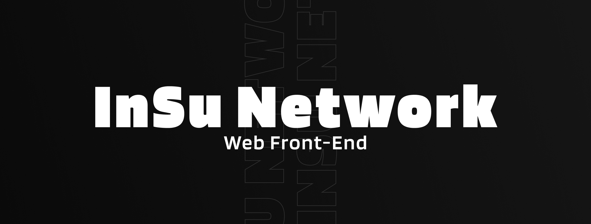

# InSu Network - Web Front-End
Benvenuto nella repository per la parte Front-End del sito di **InSu Network**, un progetto open-source dedicato al miglioramento
qualitativo e tecnologico della regione _Insubrica_.

Se sei interessato a prenderne parte, avrai vari modi di contribuire, alcuni dei quali li potrai trovare e consultare sul nostro
sito: https://www.insunet.work/. Sai già dove partire? Allora apri pure una PR.

## Compilazione & Avvio
Il progetto è realizzato interamente utilizzando il framework [NextJS](http://nextjs.org/). Per maggiori informazioni, dubbi,
chiarimenti o per le documentazioni è possibile consultare il suo sito. Di seguito sono elencati alcuni comandi base per avviare 
correttamente il progetto anche in modalità _development_.

### Installazione delle dipendenze
Per prima cosa occorrerà installare tutte le dipendenze utilizzate dal progetto, utilizzando il comando

```shell
npm install
```

### Production
Per avviare il progetto in produzione, su di un container o su una macchina dedicata, bisognerà per prima cosa compilarlo
tramite il comando:

```shell
npm run build
```

per poi eseguirlo tramite il comando:

```shell
npm run start
```

### Development
Per avviare il progetto in modalità development, invece, occorrerà eseguire il comando

```shell
npm run dev
```

## Licenza
Tutto il codice del sito principale, nonché la seguente repository, è protetta secondo la GNU General Public License v3.0
(Codice GPL-3.0 license). Si consiglia vivamente la lettura prima di incombere in problematiche di natura legali a seguito
di modifica del seguente codice.

Per qualunque dubbio, o per richieste generiche di chiarimenti, è possibile contattare direttamente i gestori del codice oppure
scrivere alla mail di servizio **info@insunet.work**.